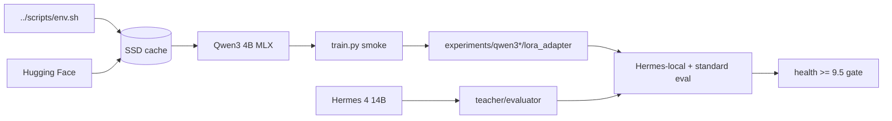

# Design — Gemma/Qwen/Hermes Track

```mermaid
flowchart LR
    ENV[../scripts/env.sh] --> CACHE[(SSD cache)]
    HF[Hugging Face] --> CACHE
    CACHE --> QWEN[Qwen3 4B MLX]
    QWEN --> TRAIN[train.py smoke]
    TRAIN --> ADAPTER[experiments/qwen3*/lora_adapter]
    HERMES4[Hermes 4 14B] --> JUDGE[teacher/evaluator]
    ADAPTER --> EVAL[Hermes-local + standard eval]
    JUDGE --> EVAL
    EVAL --> HEALTH[health >= 9.5 gate]
```

This track separates practical local fine-tunes from large-model baseline/teacher use.
